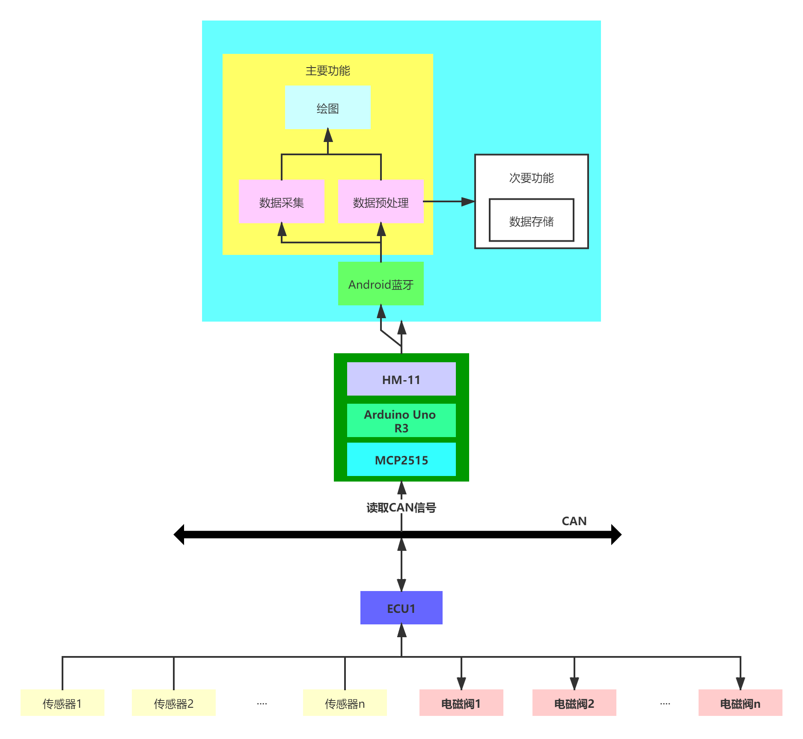
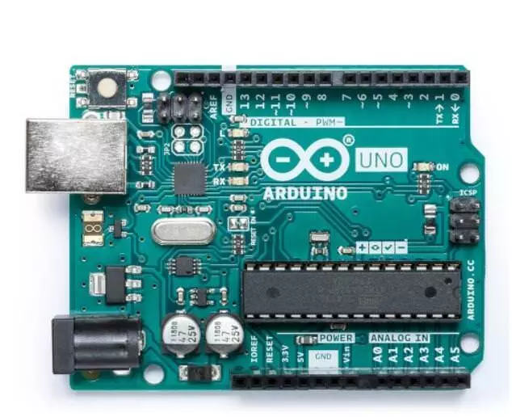
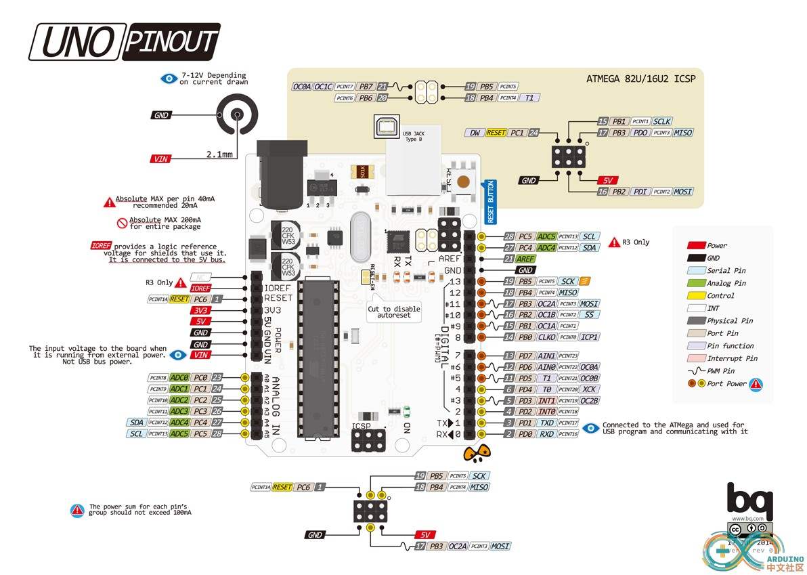
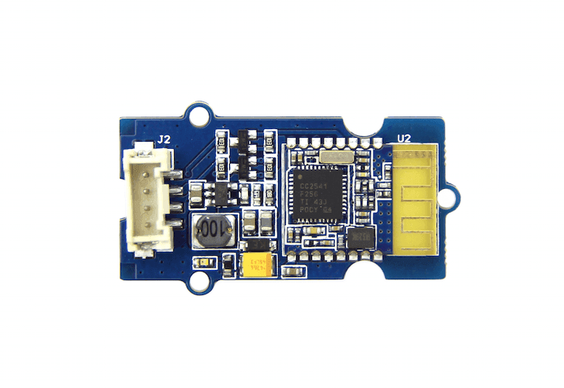
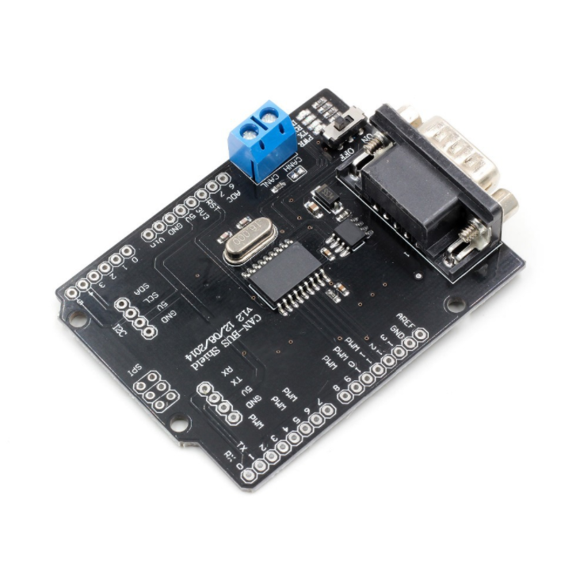

### 动力总成监控系统
#### 1 项目启动原因以及预期目标
为了在车辆运行过程中完成各总成数据的采集和监控，以实现开发阶段中既定的控制策略，所以基于CAN总线搭建动力总成监控系统。同时动力总成监控系统的能够满足搭建控制系统前期技术储备，为实现车辆网络化和智能化打下基础。预期的目标是系统能够实时准确的完成相关数据的存储和可视化。
#### 2 系统架构
从硬件的角度出发，系统架构主要分为三部分，**车辆ECU模块**，**数据采集模块**，**Android设备**

##### 2.1 车辆ECU模块
我们知道车辆电子控制系统中搭载了众多的ECU（电子控制单元），例如整车控制器，发动机控制器，自动变速器控制器，ABS（防抱死系统），助力转向系统等等。通俗的描述一下工作原理，ECU从传感器中采集数据，然后进行数据处理，逻辑判断，最后发出控制信号到电磁阀，电磁阀通过电流的改变来控制液压力的大小。人为要做的是制定相应的控制策略，让ECU合理合规安全地处理和传递信号。
在车辆网络中ECU通过CAN总线进行通信，信号之间的传递遵循CAN协议。为了便于数据的监控和车辆的故障诊断，一般ECU会把采集信号和处理信号发送到CAN总线上，通过CAN协议，我们能从CAN总线上接收到ECU发送的十六进制数据帧（通信矩阵数据库文件，.dbc后缀名的文件），对于数据帧的解析会遵循相应的规则。
一般一个标准CAN帧中包含的信息有，**消息ID**、**报文发送周期**、**报文长度**、**信号信息**等。（对于不同厂商而言，一般报文帧的解析方法不同，但有经验的诊断工程师能够知道CAN报文帧中所包含的信息，凭借这些信息可以完成对标工作。对于一些关键软件部分的关键因子数据，正常的流程需要通过标定来确认，通过对标则可以在一定程度上免去这一个流程）
一般在工作流程中直接使用CANdb++Editor，能够比较直观的读懂信号矩阵的信息。

##### 2.2 数据采集模块
采用Arduino Uno R3开发板，搭配HM-11低功耗蓝牙4.0模块以及MCP2515CAN通讯模块，在整个数据采集模块中，通过MCP2515CAN通讯模块，我们可以获取ECU传递的CAN帧，按照相应的DBC，制定相应的解析策略，这样可以使传递到Arduino Uno上的数据是可读的信息，随后在把数据通过HM-11模块，利用蓝牙转发到连接的安卓设备中。

###### 2.2.1 Arduino Uno 开发板

Arduino Uno是一款基于**ATmega328P**的微控制器板(R3基本上指国产的Arduino板子)。它有14个数字输入/输出引脚(其中6个可用作PWM输出)，6个模拟输入，16MHz晶振时钟，USB连接，电源插孔，ICSP接头和复位按钮。只需要通过USB数据线连接电脑就能供电、程序下载和数据通讯。
其硬件资源配置如下

|参数  |型号和数值  |
| --- | --- |
|微控制器  |ATMEGA328P  |
|工作电压  |5V  |
|数字I/O引脚  |14（其中6个提供PWM输出）  |
|PWM数字I/O引脚  |6  |
|模拟输入引脚  |6  |
|Flash  |32KB（ATmega328P），其中0.5KB由引导加载程序使用  |
|SRAM  |2KB（ATmega328P）|
|EEPROM  |1KB（ATmega328P）  |
|时钟  |16MHz  |
|LED_BUILTIN  |13  |

###### 2.2.2 HM-11低功耗蓝牙模块

该低功耗蓝牙模块 HM-11 支持 AT 指令的 TI CC2540 芯片。作为 Grove 产品，Grove - BLE 可以很方便地通过 Base Shield 与 Arduino 板一起使用。工作频率为2.4GHz ISM band

###### 2.2.3 MCP2515

这是一款CAN协议控制器，支持CAN V2.0B技术规范。能够发送和接受标准和拓展数据帧以及远程帧。MCP2515同时还自带两个验收屏蔽寄存器和六个验收滤波寄存器可以过滤掉不想要的报文，因此能够减少MCU的开销，通过SPI（串行外设接口）可以和Arduino Uno进行连接。
MCP2515主要由三个部分组成：

1. CAN模块，包括CAN协议引擎、验收滤波寄存器、验收屏蔽寄存器、发送和接受寄存器
2. 用于配置该器件及其运行的控制逻辑和寄存器。
3. SPI协议模块。

##### 2.3 Android设备
要实现对Arduino Uno发出的蓝牙信号的接受，我们需要具有蓝牙功能的Android设备，详细不再赘述。

#### 3 相关接口描述

#### 4 实现细节

##### 4.1 Arduino部分
###### 4.1.1
###### 4.1.2

##### 4.2 Android app部分
###### 4.2.1
###### 4.2.2
